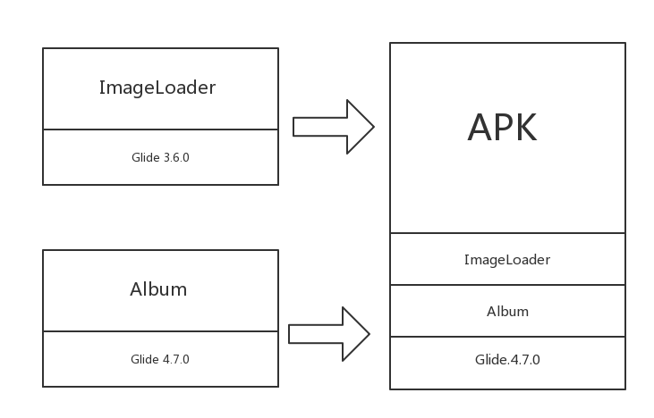
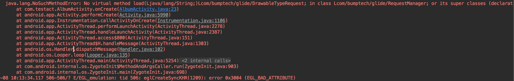
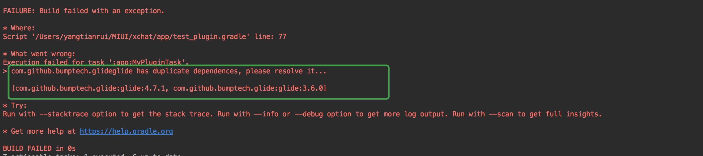
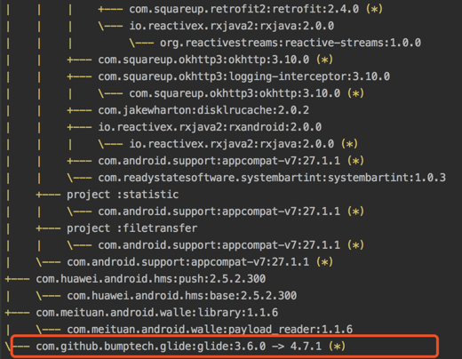

# Android依赖库版本冲突检测插件
## 目的
在Android开发过程中，我们会引入很多的第三方库，这些第三方库又会引入别的库，就可能出现版本不一致的问题。
Gradle在处理这种依赖冲突的策略是以版本最高(或指定)的版本打进APK包中。
这些问题在编译时无法发现，所以可能在运行时出现ClassNotFound，MethodNotFound之类的异常。


例如:

一个APK项目中，引入了ImageLoader和Album两个第三方库，这两个库引用的Glide版本不一致，
在最后打包的过程中，低版本会被忽略。



如果依赖库的高版本不支持低版本的API的话，那么就会出现运行时异常了，这个错误只能在运行时出现。

Album模块因为编译时api和运行时api不同导致出现了这个`NoSuchMethodError`错误。



这个插件的作用就是解决上面的问题，如果在编译时发现有版本不一致，就会停止编译，提示开发者解决。

## 使用
1. 添加maven仓库，后续会传到jCenter，不用单独配置了。
```
repositories {
        maven {
            url 'https://yangtianrui.bintray.com/maven'
        }
    }
```
2. 项目根目录中的build.gradle中添加依赖
```
 dependencies {
        classpath 'com.yangtianrui.tools.rdc:RuntimeDependenceChecker:1.0.0'
 }
```

3. 在APP模块的build.gradle中引入plugin
```
apply plugin: 'DependenceChecker'
```
4. 添加配置

`variant`表示需要检测的构建类型，这里以release为例。
`abortBuild`表示如果出现依赖冲突时，停止编译。
```
DependenceChecker {
    variant = 'release'
    abortBuild = true
}
```

例如：
这里在主项目中的Glide版本和其他模块的Glide版本冲突，如果配置了`abortBuild`那么就会停止编译，我们需要处理此冲突，否则运行时可能出现异常。



## 依赖冲突的处理
1. 使用`./gradlew :app:dependencies`查看出来冲突的版本。



2. 将冲突库的其中一个或多个升级或降级，将依赖库版本对齐。

## TODO
1. 发布到jCenter()
2. 尽可能详细显示冲突位置，目前只是终止编译和提供了冲突的版本