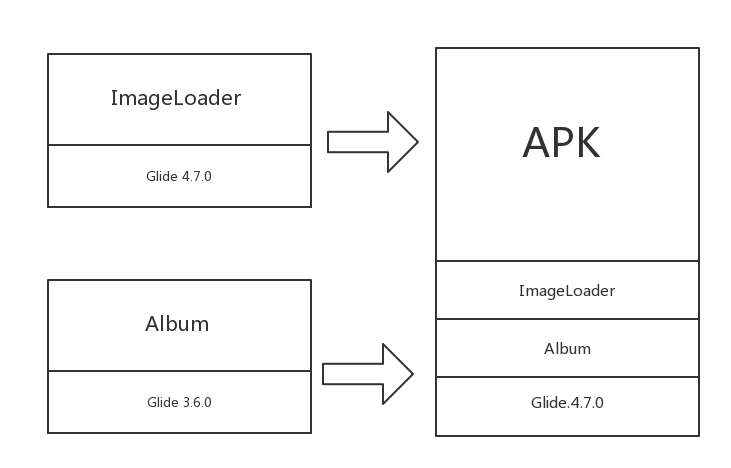

# Android依赖库版本冲突检测插件
## 目的
在Android开发过程中，我们会引入很多的第三方库，这些第三方库又会引入别的库，就可能出现版本不一致的问题。
Gradle在处理这种依赖冲突的策略是以版本最高(或指定)的版本打进APK包中。
这些问题在编译时无法发现，所以可能在运行时出现ClassNotFound，MethodNotFound之类的异常。


例如:

一个APK项目中，引入了ImageLoader和Album两个第三方库，这两个库引用的Glide版本不一致，
在最后打包的过程中，低版本会被忽略。



如果依赖库的高版本不支持低版本的API的话，那么就会出现运行时异常了，这个错误只能在运行时出现。

Album模块因为编译时api和运行时api不同导致出现了这个`NoSuchMethodError`错误。


这个插件的作用就是解决上面的问题，如果在编译时发现有版本不一致，就会停止编译，提示开发者解决。

## 原理简介

首先我们自定义一个Gradle Plugin，然后我们将这个Plugin的task hook到编译的task中，这里我们选择的hook点是preBuild，大家可以看下，这个是最先运行的task，在这个位置检测依赖比较合适。
`target.tasks.findByName('preBuild').dependsOn(target.tasks.findByName(PLUGIN_NAME))`


在apply方法中，从Project中可以获取Configuration，我们遍历这些Configuration对象，找到名字是releaseRuntimeClassPath的，这个代表编译模式是release情况下，运行时的所有ClassPath依赖。


找到这个Configuration后，我们在从这个Configuration中获取所有的dependencies
` conf.incoming.resolutionResult.root.dependencies`，dependencies可能会依赖一些子Module，这些子Module仍然会依赖别的模块，所以此处需要递归进行处理。
```groovy
// Plugin的apply方法
@Override
void apply(Project target) {

    // 创建一个Ext数据
    target.extensions.create(EXT_NAME, DependenceChecker)
    println("=============apply===============")
    DependenceChecker ext = target.extensions.DependenceChecker

    // 向Project中追加一个Task
    target.task(PLUGIN_NAME) << {

        Map depMap = new HashMap()
        String checkMode = "${ext.variant}runtimeclasspath"
        println target.configurations
        target.configurations.each { Configuration conf ->

            //  考虑多个Flavor的情况
            if (conf.name.toLowerCase().contains(checkMode)) {
                // 获取所有依赖信息
                conf.incoming.resolutionResult.root.dependencies.each { dr ->
                    resolveDependencies(depMap, dr)
                }
                printDepInfo(depMap)
                reportDepInfo(depMap, ext.abortBuild)
            }
        }
    }
    target.tasks.findByName('preBuild').dependsOn(target.tasks.findByName(PLUGIN_NAME))
}
```

递归处理所有的依赖

```groovy
static def resolveDependencies(Map<String, Set<String>> map, DependencyResult dr) {

    def depName = dr.requested.displayName
    if (dr != null && !depName.contains("project")) {
        String[] depSplit = depName.split(":")
        if (depSplit.length > 2) {
            def packageName = depSplit[0] + depSplit[1]
            def list = map.get(packageName)
            if (list == null) {
                list = new HashSet<String>()
                map.put(packageName, list)
            }
            list.add(depName)
        }
    }
    // 如果这个dependences的类型是ResolvedDependencyResult，那么它内部还有依赖关系
    if (dr instanceof ResolvedDependencyResult) {
        dr.selected.dependencies.each { subDr ->
            resolveDependencies(map, subDr)
        }
    }
}

```

核心检测逻辑是我们如果判断同一个ClassPath对象是否有两个版本，如果存在两个版本，那么证明我们的项目中存在依赖冲突，运行时存在风险。所以终止编译，抛出个异常告诉开发者。

```groovy
static def reportDepInfo(Map depMap, boolean abortBuild) {

        depMap.each { k, v ->
            if (v.size() > 1) {
                if (abortBuild) {
                    throw new RuntimeException("${k} has duplicate dependences, please resolve it...\n\n${v}")
                }
            }
        }
    }
```


## 使用
1. 添加maven仓库，后续会传到jCenter，不用单独配置了。
```
repositories {
        maven {
            url 'https://yangtianrui.bintray.com/maven'
        }
    }
```
2. 项目根目录中的build.gradle中添加依赖
```
 dependencies {
        classpath 'com.yangtianrui.tools.rdc:RuntimeDependenceChecker:1.0.0'
 }
```

3. 在APP模块的build.gradle中引入plugin
```
apply plugin: 'DependenceChecker'
```
4. 添加配置

`variant`表示需要检测的构建类型，这里以release为例。
`abortBuild`表示如果出现依赖冲突时，停止编译。
```
DependenceChecker {
    variant = 'release'
    abortBuild = true
}
```

例如：
这里在主项目中的Glide版本和其他模块的Glide版本冲突，如果配置了`abortBuild`那么就会停止编译，我们需要处理此冲突，否则运行时可能出现异常。


## 依赖冲突的处理
1. 使用`./gradlew :app:dependencies`查看出来冲突的版本。


2. 将冲突库的其中一个或多个升级或降级，将依赖库版本对齐。

## TODO
1. 发布到jCenter()
2. 尽可能详细显示冲突位置，目前只是终止编译和提供了冲突的版本